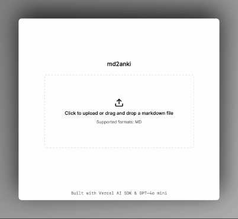

# md2anki: AI-Powered Anki Flashcard Generator


md2anki is an open-source web app that uses AI to generate Anki flashcards from Markdown files, making it easier to turn your notes into study materials.

Built with the [Vercel AI SDK](https://sdk.vercel.ai), [GPT-4o-mini](https://platform.openai.com/docs/models/gpt-4o-mini), [Next.js](https://nextjs.org), [Langfuse](https://langfuse.com), and [Seline.so](https://seline.so).

[](https://vercel.com/new/clone?repository-url=https%3A%2F%2Fgithub.com%2Fvercel%2Fnext.js%2Ftree%2Fcanary%2Fexamples%2Fhello-world&env=OPENAI_API_KEY,OPENAI_MODEL,LANGFUSE_SECRET_KEY,LANGFUSE_PUBLIC_KEY,LANGFUSE_HOST&project-name=md2anki&repository-name=md2anki)

<!-- add gif -->


## Usage

1. Upload a Markdown file containing the content you want to convert into flashcards.
2. Click the "Generate flashcards" button to start the AI-powered generation process.
3. Review and edit the generated flashcards as needed.
4. Download the flashcards as an Anki-compatible `.apkg` file.
5. Import the `.apkg` file into Anki to start studying!

## Development 

### Prerequisites

- Node.js (v14 or later)
- npm or yarn
- OpenAI API key
- (Optional) Seline.so and Langfuse accounts for analytics

### Installation

1. Clone the repository:
   ```bash
   git clone https://github.com/yourusername/md2anki.git
   cd md2anki
   ```

2. Install dependencies:
   ```bash
   npm install
   ```
   or
   ```bash
   yarn install
   ```

3. Set up environment variables:
   Create a `.env.local` file in the root directory and add the following:
   ```env
   OPENAI_API_KEY=your_openai_api_key
   OPENAI_MODEL=your_openai_model (optional, defaults to `gpt-4o-mini-2024-07-18`)
   LANGFUSE_PUBLIC_KEY=your_langfuse_public_key (optional)
   LANGFUSE_SECRET_KEY=your_langfuse_secret_key (optional)
   LANGFUSE_HOST=your_langfuse_host (optional)
   ```

4. Run the development server:
   ```bash
   npm run dev
   ```
   or
   ```bash
   yarn dev
   ```

5. Open [http://localhost:3000](http://localhost:3000) in your browser to see the application.

## Contributing

Contributions are welcome! Please feel free to submit a Pull Request.

## License

This project is licensed under the GPL-3.0 License. See the [LICENSE](LICENSE) file for details.

